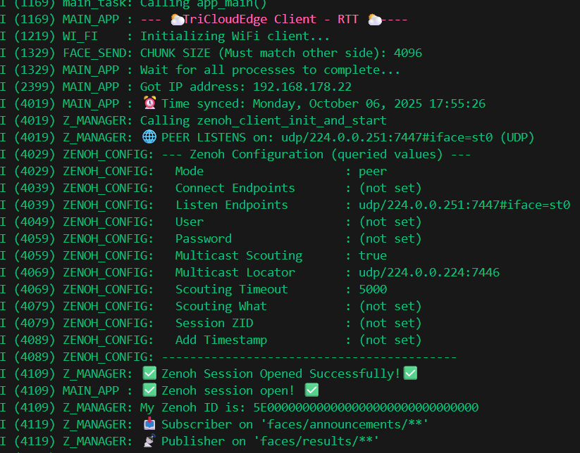

# Zenoh Communication Module for ESP32

This folder contains a self-contained, plug-and-play module for handling [Zenoh](https://zenoh.io/) communication on ESP32 devices. It is designed to abstract away the complexities of the Zenoh-pico C API, providing a simple, configuration-driven interface for peer-to-peer or client-server messaging.

The module is autonomous: to use it, you just need to copy this `zenoh` directory into your project's `main` folder and configure your device's role and transport settings in a single header file.



## Key Features

*   **Simplified Configuration**: All settings are centralized in `zenoh_config.h`. Just define the device role and transport type.
*   **Role-Based Architecture**: Pre-defined `ZENOH_ROLE_CLIENT` and `ZENOH_ROLE_SERVER` roles simplify application logic.
*   **Transport Abstraction**: Easily switch between TCP (client or peer) and UDP (multicast peer) modes.
*   **Lifecycle Management**: Automatically handles Zenoh session initialization, resource declaration (publishers, subscribers, queryables), and clean shutdown.
*   **Helper Utilities**: Provides utilities for network interface detection and logging.
*   **Optional Features**: Includes built-in, toggleable support for heartbeats and network scouting.

## File Structure

*   `zenoh_config.h`: **(User facing)** The single source of truth for all Zenoh settings.
*   `zenoh_manager.h` / `.cpp`: The core engine that manages the Zenoh session, tasks, and API calls.
*   `zenoh_heartbeat.h` / `.c`: An optional module for sending and receiving periodic heartbeats.
*   `zenoh_scout.h` / `.c`: An optional module for discovering other Zenoh peers on the network.
*   `zenoh_utils.h` / `.c`: Helper functions for network interface discovery.

## How to Use

### 1. Integration

Copy the entire `zenoh/` directory into the `main/` folder of your ESP-IDF project.

### 2. Configuration

Open `zenoh/zenoh_config.h` and modify the **User Configuration** section. This is the only file you need to edit.

```c
// zenoh/zenoh_config.h

// 1. DEFINE THE ROLE OF THIS DEVICE
//    - ZENOH_ROLE_CLIENT: The device that sends data (e.g., ESP32-CAM).
//    - ZENOH_ROLE_SERVER: The device that receives data (e.g., ESP32-S3).
#define ZENOH_DEVICE_ROLE ZENOH_ROLE_CLIENT

// 2. DEFINE THE ZENOH TRANSPORT AND MODE
//    - ZENOH_TRANSPORT_TCP_CLIENT: Connects to a specific server IP.
//    - ZENOH_TRANSPORT_TCP_PEER:   Listens for incoming TCP connections.
//    - ZENOH_TRANSPORT_UDP_PEER:   Listens on a multicast address.
#define ZENOH_TRANSPORT ZENOH_TRANSPORT_TCP_CLIENT

// 3. DEFINE NETWORK ENDPOINTS
#define ZENOH_SERVER_IP "192.168.1.100" // IP of the ZENOH_ROLE_SERVER device.
#define ZENOH_PORT "7447"

// 4. FEATURE FLAGS (Optional)
#define PUBLISHER_ON 1
#define SUBSCRIBER_ON 1
#define HEARTBEAT_ON 0
```

Based on your choices, the correct Zenoh `mode` (`client` or `peer`) and transport endpoints are automatically generated. The pre-processor directives will raise a compile-time error if you select an invalid combination (e.g., a `SERVER` role with a `TCP_CLIENT` transport).

### IMPORTANT NOTE FOR TCP PEER 
Apply the following in idf.py menuconfig
Component config -LWIP
[*] Enable SO_LINGER processing

**BE CAREFUL: in zenoh config.h, they have to be the same at both communicating sides!**
#define Z_FRAG_MAX_SIZE 1024
#define Z_BATCH_UNICAST_SIZE 1024
#define Z_BATCH_MULTICAST_SIZE 1024
#define Z_CONFIG_SOCKET_TIMEOUT 3000
## Main Application Example

Here is a complete example of how to integrate this module into your `app_main.cpp`. It demonstrates initializing WiFi, starting the Zenoh manager, and using its publish/subscribe functionality.

```cpp
// app_main.cpp

#include "freertos/FreeRTOS.h"
#include "freertos/event_groups.h"
#include "esp_wifi.h"
#include "esp_log.h"
#include "nvs_flash.h"

// 1. Include the Zenoh manager
#include "zenoh/zenoh_manager.h"

static const char* TAG = "MAIN_APP";
static EventGroupHandle_t s_app_event_group;

// Define a bit for WiFi connection status
#define WIFI_CONNECTED_BIT (1 << 0)

// --- Data Handler Callback ---
// This function will be called whenever data is received on a subscribed key expression.
void data_handler_callback(z_loaned_sample_t* sample, void* arg) {
    z_owned_string_t payload_str;
    z_bytes_to_string(z_sample_payload(sample), &payload_str);

    z_view_string_t key_expr_str;
    z_keyexpr_as_view_string(z_sample_keyexpr(sample), &key_expr_str);

    ESP_LOGI(TAG, ">> Received data '%.*s' on key '%.*s'",
             (int)z_string_len(z_loan(payload_str)), z_string_data(z_loan(payload_str)),
             (int)z_string_len(z_loan(key_expr_str)), z_string_data(z_loan(key_expr_str)));

    // IMPORTANT: Free the payload string memory
    z_drop(z_move(payload_str));
}

// --- WiFi and IP Event Handler ---
static void app_event_handler(void* arg, esp_event_base_t event_base,
            int32_t event_id, void* event_data) {
    if (event_base == WIFI_EVENT && event_id == WIFI_EVENT_STA_DISCONNECTED) {
        ESP_LOGI(TAG, "Wi-Fi disconnected, trying to reconnect...");
        esp_wifi_connect();
    } else if (event_base == IP_EVENT && event_id == IP_EVENT_STA_GOT_IP) {
        ip_event_got_ip_t* event = (ip_event_got_ip_t*) event_data;
        ESP_LOGI(TAG, "Got IP address: " IPSTR, IP2STR(&event->ip_info.ip));
        xEventGroupSetBits(s_app_event_group, WIFI_CONNECTED_BIT);
    }
}

// --- Main Application ---
extern "C" void app_main() {
    // --- Standard ESP-IDF Initialization ---
    ESP_ERROR_CHECK(nvs_flash_init());
    ESP_ERROR_CHECK(esp_netif_init());
    ESP_ERROR_CHECK(esp_event_loop_create_default());
    s_app_event_group = xEventGroupCreate();

    // Register WiFi and IP event handlers
    ESP_ERROR_CHECK(esp_event_handler_register(IP_EVENT, IP_EVENT_STA_GOT_IP, &app_event_handler, NULL));
    ESP_ERROR_CHECK(esp_event_handler_register(WIFI_EVENT, ESP_EVENT_ANY_ID, &app_event_handler, NULL));

    // Configure and start WiFi
    wifi_init_config_t cfg = WIFI_INIT_CONFIG_DEFAULT();
    ESP_ERROR_CHECK(esp_wifi_init(&cfg));
    esp_netif_create_default_wifi_sta();
    wifi_config_t wifi_config = { .sta = { .ssid = "YOUR_WIFI_SSID", .password = "YOUR_WIFI_PASSWORD" } };
    ESP_ERROR_CHECK(esp_wifi_set_mode(WIFI_MODE_STA));
    ESP_ERROR_CHECK(esp_wifi_set_config(WIFI_IF_STA, &wifi_config));
    ESP_ERROR_CHECK(esp_wifi_start());
    ESP_ERROR_CHECK(esp_wifi_connect());

    ESP_LOGI(TAG, "Waiting for WiFi connection...");
    xEventGroupWaitBits(s_app_event_group, WIFI_CONNECTED_BIT, pdFALSE, pdFALSE, portMAX_DELAY);
    ESP_LOGI(TAG, "WiFi Connected!");

    // ZENOH
    ESP_LOGI(TAG, "Starting Zenoh Manager...");
    zenoh_client_init_and_start(s_app_event_group, data_handler_callback);

    ESP_LOGI(TAG, "Waiting for Zenoh session to open...");
    xEventGroupWaitBits(s_app_event_group, ZENOH_CONNECTED_BIT, pdFALSE, pdFALSE, portMAX_DELAY);
    ESP_LOGI(TAG, "Zenoh Session Open!");

    xEventGroupWaitBits(s_app_event_group, ZENOH_DECLARED_BIT, pdFALSE, pdFALSE, portMAX_DELAY);
    ESP_LOGI(TAG, "Zenoh Resources Declared!");

    int counter = 0;
    while (1) {
        char payload[32];
        snprintf(payload, sizeof(payload), "Hello #%d", counter++);

        // For a CLIENT, this publishes to "faces/announcements/**"
        // For a SERVER, this publishes to "faces/results/**"
        zenoh_publish(KEYEXPR_PUB, payload);

        vTaskDelay(pdMS_TO_TICKS(5000));
    }
}
```